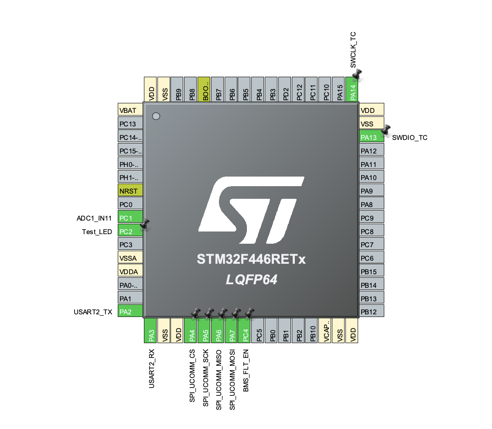
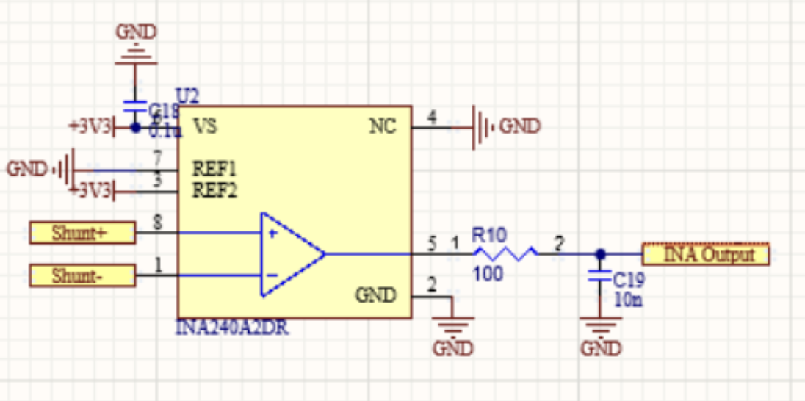
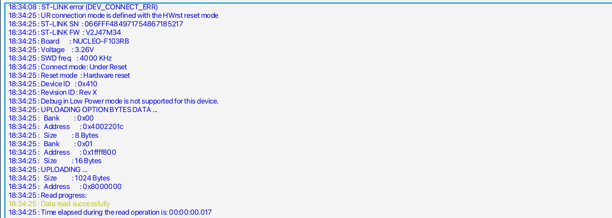

# Edward's Lab Notebook – Scooter BMS System

This notebook documents my personal contributions to the scooter battery management system (BMS) project. My partners maintain their own separate notebooks for their work.

## Pre April 1, 2026

I soldered all SMD components on the slave board except for the LTC, transistor, and transformers. 

## April 1, 2026

I added the current value to the BMS UART message so that real-time current draw data is now included in the telemetry packet sent from the BMS to the scooter controller.

## April 4, 2026

I updated the IOC configuration in STM32CubeMX to simplify communication. After making these changes, I verified that there were no compilation errors. We also 

## April 6, 2026

I fixed several pin assignments in the IOC that were causing conflicts with other peripherals. I then added voltage and temperature simulation capabilities to allow testing of the BMS logic without requiring hardware. I temporarily disabled fault handling to make debugging easier. Finally, I added additional ADC pins to the IOC configuration for reading analog sensors such as current and auxiliary inputs.

## April 16, 2026

I initiated a new IOC configuration for the STM32F1 Nucleo board as an alternative hardware target for the BMS system before our actual STM is in working configuration. We were successfully able to demonstrate a working charge counting algorithm on the dev board.

## April 21, 2026

I updated the git ignore file to exclude build artifacts and IDE files from the repository. I also merged the `devj_mock` branch into the main development line to integrate mock telemetry code. We were able to establish a correct uart communication of the devboard stm with the BMS viewer. We also moved the current counting input source to go through the INA240 so it is exactly the same as our final result.

## April 26, 2026

I resolved all remaining compilation issues, and the code now builds without any errors. We confirmed the attachment of the stm on the pcb to the computer through ST-link with the STM Programmer and STM CUBE IDE when flashing.

## April 27, 2026

I merged the Nucleo code from the `stmuart_bridge` branch to integrate UART bridge functionality into the main firmware. I then refined the shunt measurement code by adjusting gain and offset calculations and improving noise filtering on the ADC readings. I also changed the LTC battery cell monitor communication to use SPI Mode 3 for proper timing. During the same time we used oscilloscope to ensure correct spi communication was established between the STM chip and the LTC6820.

## April 28, 2026

I re-enabled fault handling after completing debugging, so the system now responds to overcurrent, overvoltage, and overtemperature conditions. I also uncommented a previously commented section of code that contained critical initialization instructions.